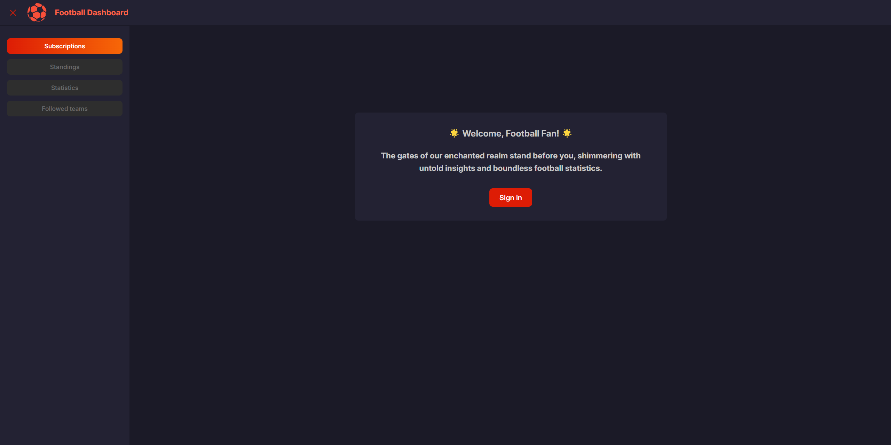
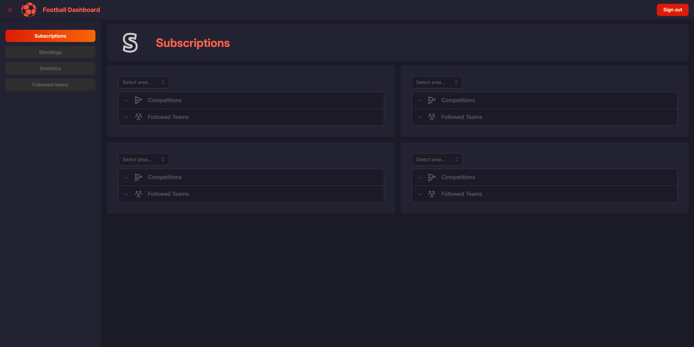
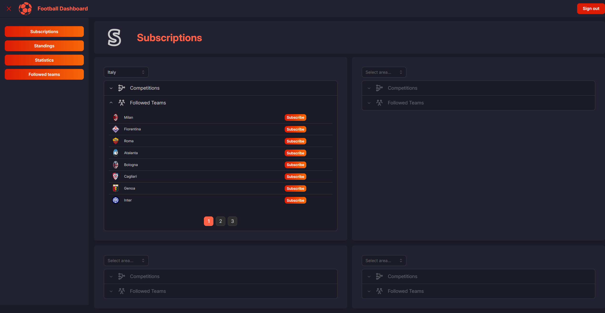
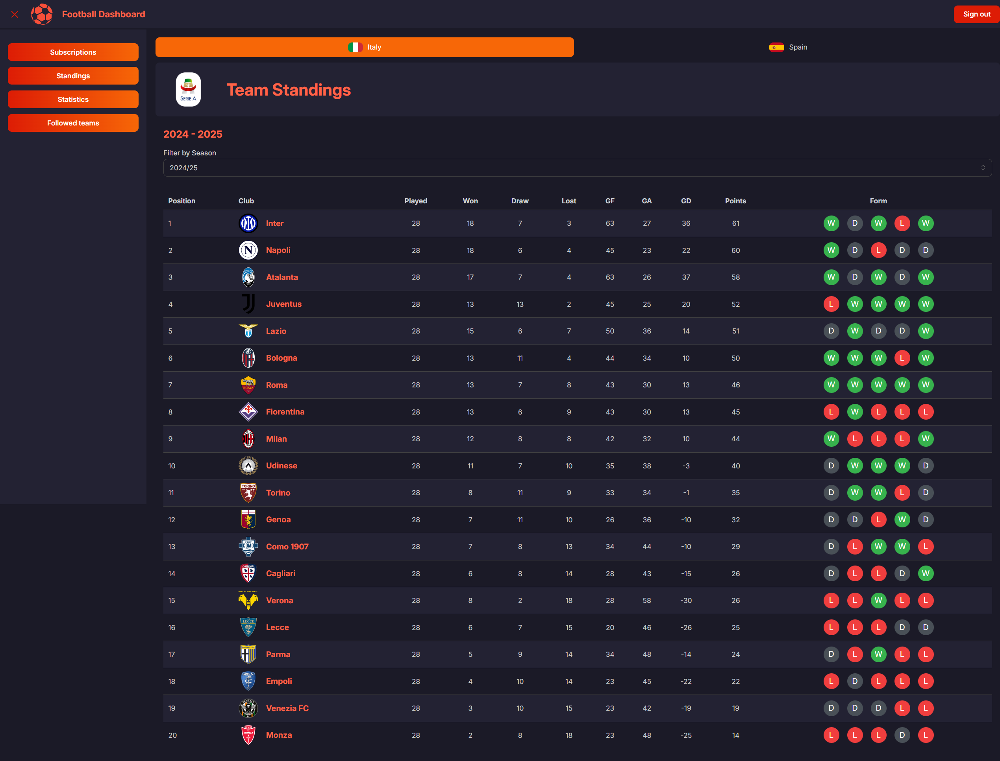
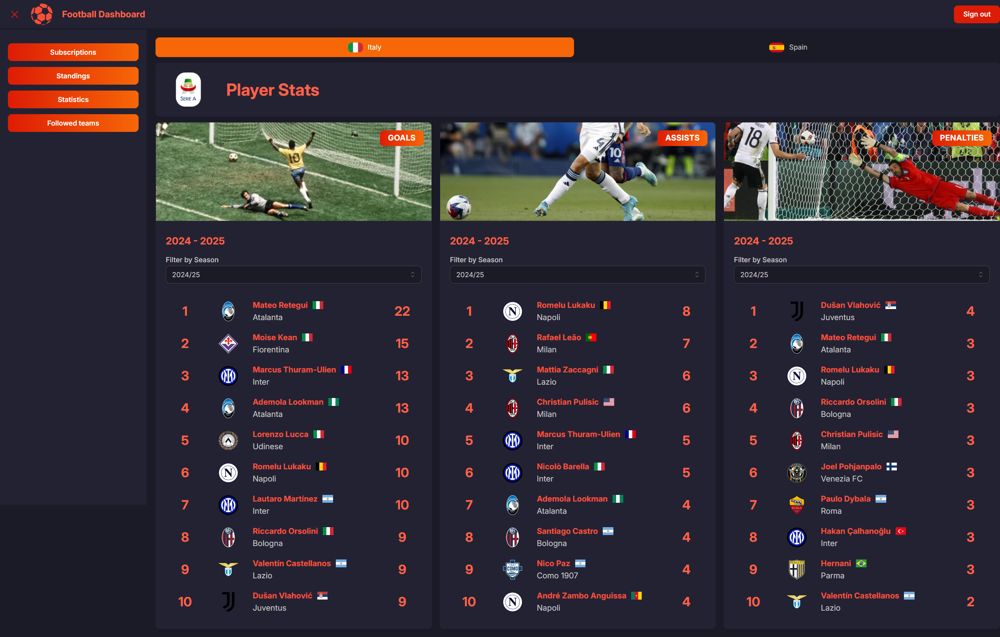
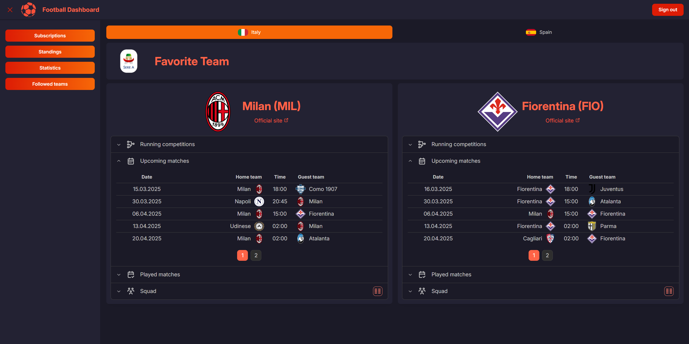
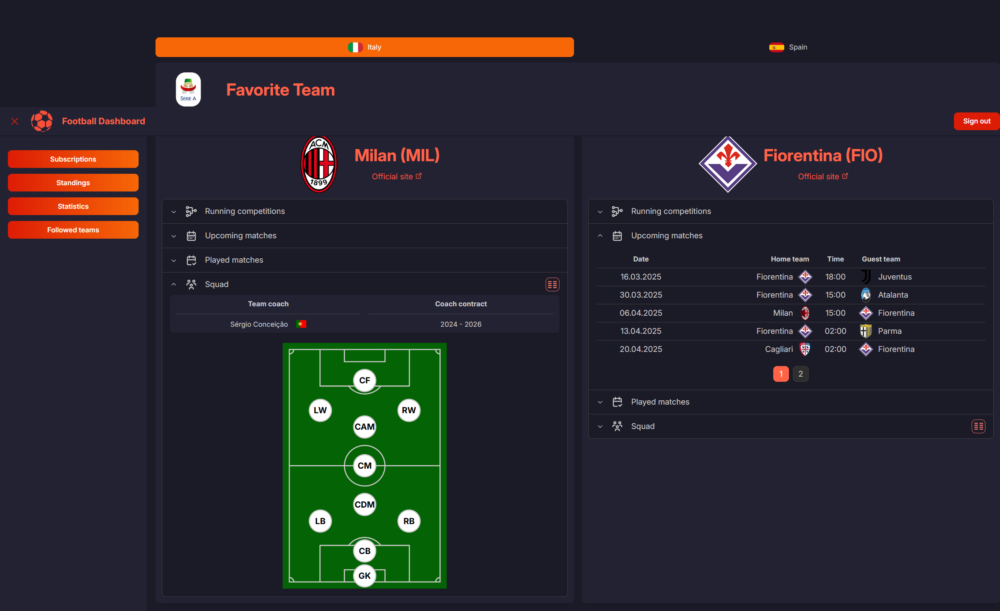

# General Project Info
This SPA (Single Page Application) is built using React and Vite, focusing on football statistics. `https://www.football-data.org` API is used as a data source. The application displays different pages:

<details>
  <summary>Click to expand screenshots</summary>

* Login page
  
* Subscriptions page
  

  
* Standings page
  
* Player stats page
  
* Followed teams page
  

  

</details>

## Chosen libraries
* Mantine
* Redux
* React router
* React Oidc Context
* Tabler Icons
* Axios
* Iso-3166-1
* Vite
* Sonda

## Github actions descriptions

* Build application workflow
  * [build_application.yml](https://github.com/GuardiansEducation/ReactDashboardApp/blob/master/.github/workflows/build_application.yml#L1) - used to build application inside Github runner and push bundle to AWS S3 Bucket.
* Build lambda workflow
  * [build_lambdas.yml](https://github.com/GuardiansEducation/ReactDashboardApp/blob/master/.github/workflows/build_lambdas.yml#L1) - used to create lambda zip archive and publish it to AWS Lambda

# Commands
 * dev - Run vite in development mode with file watch
 * build - Create production build
 * analyze - Run bundle analyzer
 * lint - Run linting
 * typecheck - Run type check
 * preview - Run application in production mode

# AWS Infrastructure
## AWS API Gateway and AWS Lambda
* AWS Gateway was created to integrate AWS Lambda [lambda/index.mjs](https://github.com/GuardiansEducation/ReactDashboardApp/blob/master/lambdas/proxy/index.mjs#L3) used in order to proxy API request to third party API provider.
* For local development Vite proxy functionality was used. Details in [vite.config.ts](https://github.com/GuardiansEducation/ReactDashboardApp/blob/master/vite.config.ts#L16)
## AWS S3
* AWS S3 bucket was used for static website hosting. There is an important limitation connected with such an approach - S3 bucket static hosting is HTTP only.
* S3 bucket permissions were assigned to bucket to allow public access:
```json
{
  "Version": "2012-10-17",
  "Statement": [
    {
      "Sid": "PublicReadGetObject",
      "Effect": "Allow",
      "Principal": "*",
      "Action": "s3:GetObject",
      "Resource": "arn:aws:s3:::guardians-dashboard/*"
    },
    {
      "Effect": "Allow",
      "Principal": "*",
      "Action": "s3:ListBucket",
      "Resource": "arn:aws:s3:::guardians-dashboard",
      "Condition": {
        "StringEquals": {
          "aws:PrincipalOrgID": "o-vp2*****"
        }
      }
    }
  ]
}
```
* Here is an example of S3 static hosting redirect config (used to resolve 404 requests in a reasonable way):
```json
[
  {
    "Condition": {
      "HttpErrorCodeReturnedEquals": "404"
    },
    "Redirect": {
      "ReplaceKeyWith": ""
    }
  }
]
```
## AWS Cognito
* Simple authentication flow was added with use of AWS Cognito.
* Cognito handles user authentication and authorization. Users are stored within user pool (must be created as well).
* OIDC client was created and configured. Configuration details can be found here [CognitoConfigProvider.tsx](https://github.com/GuardiansEducation/ReactDashboardApp/blob/master/src/components/CognitoConfigProvider.tsx#L6-L7)
* Due to HTTP only S3 hosting and Cognito limitations, authorization is not available on hosted site. As per AWS documentation:
> `Amazon Cognito requires HTTPS over HTTP except for http://localhost/ for testing purposes only`.

# Mocked authorization flow description
* In order to allow application usage without AWS infrastructure, [MockAuthProvider](https://github.com/GuardiansEducation/ReactDashboardApp/blob/master/src/contexts/MockAuthProvider.tsx#L8) was created. By default it is enabled via `USE_CUSTOM_AUTH` environment variable. Common authentication state provided by [MockAuthContext](https://github.com/GuardiansEducation/ReactDashboardApp/blob/master/src/contexts/MockAuthContext.ts#L8)
